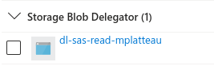
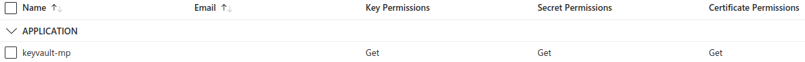
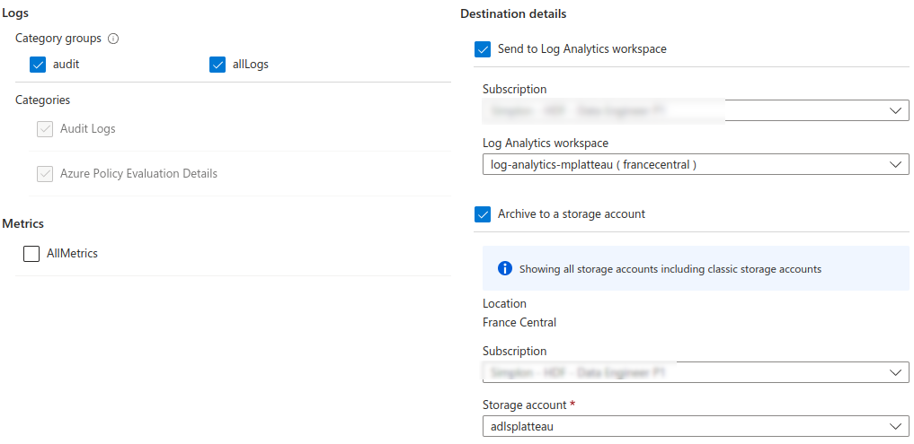

# Datalake-brief

## Datalake partie 2 : Ingestion avancée, monitoring et sécurité 
### Contexte fictif 
En tant que **Data Ingénieur** au sein de l’entreprise **DataMoniSec**, vous êtes chargé de mettre en place une infrastructure de données robuste et sécurisée sur **Microsoft Azure**. Votre mission s’articule de la **sécurité** et du **monitoring** du data lake.

Votre mission est de :

- **Configurer** un Data Lake pour centraliser les données de l'entreprise.
- **Ingérer** des données provenant de différentes sources.
- Mettre en place des mesures de **sécurité** avancées pour protéger les données sensibles.
- Configurer **Azure Databricks** pour permettre à l'équipe Data Science d'analyser les données.
- Implémenter un système de **monitoring** et d'**alertes** pour surveiller l'infrastructure.
- [Bonus] : **Spark, terraform, pricing, ingestion avancée**

### Partie 1 : Veille 

### Partie 2 : Création et ingestion sécurisée sur le datalake 

Les ressources créées depuis le portail Azure sont : 
- un service principal secondaire : **keyvault-mplatteu** 
- un service principal : **dl-sas-read-mplatteau** 
- un keyvault : **kv-mplatteau**
- un datalake : **adlsplatteau**
- un container dans le datalake : **datastorage**

Dans la configuration du datalake, le rôle de **Storage Blob Delegator** est attribué au service principal, ce qui lui permettra de créer des SAS Token. Toutefois, le SAS token généré ne va hériter que de ce rôle de Delegator, ce qui ne permet pas d'écrire dans le datalake. Il faut donc également ajouter le rôle **Storage Blob Data Contributor**. 
Finalement, le rôle **Storage Blob Data Contributor** est suffisant car il inclut beaucuop de droits. Si on utilise ce rôle, on peut écrire dans le Blob sans SAS. 
Donc ça fonctionne uniquement si on a le rôle **Storage Blob Data Contributor** : 
- avec le SAS, car il hérite de ce rôle Contributor ; 
- sans le SAS, car il n'est pas nécessaire, le rôle Contributor permet déjà d'écrire dans le blob.



Dans la configuration *Access Policies* du keyvault, les droits **get** sont attribués au service principal secondaire, ce qui lui permettra de lire le secret **sp-secret**. Celui-ci correspond au password du service principal. 



Le code dans le fichier **ingestion-datalake.py** permet de : 
- se connecter au keyvault à l'aide du service principal secondaire 
- récupérer le secret du service principal dans le key vault 
- utiliser le service principal pour créer une User Delegation Key puis un SAS Token 
- uploader des fichiers depuis [ce site](https://insideairbnb.com/get-the-data/) vers le datalake. 

Il est possible de **monitorer l'accès au secret** stocké dans le Keyvault. Pour cela il faut : 
- créer un **diagnostic setting** en sélectionnant les logs souhaités et la cible où seront stockés les logs (un log analytic workspace est créé auparavant si besoin) 



- les opérations peuvent ensuite être visualisées dans Monitoring > Insights > Opérations 
- on peut aussi retrouver les logs concernant les opérations sur le key vault avec la query : 
```sql
AzureDiagnostics
| where ResourceType  == "VAULTS"
```
- on peut retrouver dans la colonne **identity_claim_appid_g** le client ID du service principal qui s'est connecté au keyvault pour accéder au secret.