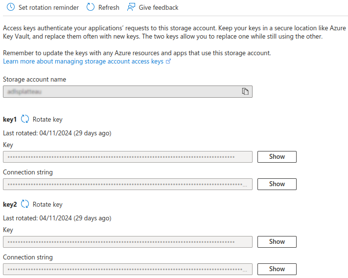

# Datalake-brief

## Datalake partie 2 : Ingestion avancée, monitoring et sécurité 
### Contexte fictif 
En tant que **Data Ingénieur** au sein de l’entreprise **DataMoniSec**, vous êtes chargé de mettre en place une infrastructure de données robuste et sécurisée sur **Microsoft Azure**. Votre mission s’articule de la **sécurité** et du **monitoring** du data lake.

Votre mission est de :

- **Configurer** un Data Lake pour centraliser les données de l'entreprise.
- **Ingérer** des données provenant de différentes sources.
- Mettre en place des mesures de **sécurité** avancées pour protéger les données sensibles.
- Configurer **Azure Databricks** pour permettre à l'équipe Data Science d'analyser les données.
- Implémenter un système de **monitoring** et d'**alertes** pour surveiller l'infrastructure.
- [Bonus] : **Spark, terraform, pricing, ingestion avancée**

### Partie 1 : Veille 

## Storage Access Keys

Les **storage access keys** sont les clés générées automatiquement à la création d’un storage account et qui permettent un accès global au compte de stockage. 
On peut les visualiser dans la section Security + networking. 



 On les utilise en tant que credential pour se connecter au compte de stockage. 


Avec Azure CLI on peut visualiser les clés : 
```bash
az storage account keys list \
    -- resource-group <resource-group> \
    -- account-name <storage-account>
```

Il est conseillé de regénérer régulièrement les clés (il est possible de créer une alerte en choisissant la fréquence souhaitée de rotation des clés) : 
- depuis le portail Azure 
- avec Azure CLI.

```bash
az storage account keys renew \
    -- resource-group <resource-group> \
    -- account-name <storage-account> \
    -- key primary 
```

## Shared Access Signatures 

Permet de contrôler l’accès aux données : à quelles données un utilisateur peut accéder, quelles autorisations il a, combien de temps il peut y accéder … sans transmettre les clés d’accès principales (storage access keys).

Le SAS est un token qu’on ajoute à l’URI de la ressource Azure Storage et qui permet l’accès aux données, tout en indiquant quel accès est donné.

On peut avoir SAS au niveau “compte” : Account SAS, qui offre un accès global à la ressource basé sur les clés du compte de stockage. 

On peut avoir un SAS au niveau “utilisateur” : User delegation SAS, qui est basée sur les identifiants Microsoft Entra ID. 

## Microsoft Entra ID 

Service de gestion des identités et des accès informatiques des utilisateurs. Permet de gérer les utilisateurs, les applications et les ressources dans un environnement sécurisé. Fournit des identités uniques pour accéder à des applications. Permet de contrôler l’accès sur la base de rôles spécifiques attribués aux utilisateurs.

## Azure Key Vault 

Stockage des secrets. Accès sécurisé aux secrets (ex: clé d’API, mots de passe, clé de chiffrement…). Il est possible d’accéder au key vault en utilisant les rôles définis dans Microsoft Entra ID.

Pour s’authentifier auprès des key vault : 
- identités managées 
- service princpal

## IAM et role-based access control (RBAC)

Système d’autorisation pour gérer l’accès aux ressources Azure. L’accès repose sur l’attribution de rôles aux utilisateurs, aux groupes, aux services principaux ou aux identités managées.
Le rôle doit concerner une étendue (scope) définie dès son attribution.

Sur la ressource dont on veut gérer les accès : 
- access control (IAM)
- role assignments 
- add role assignment 
- sélectionner le rôle souhaité 
- sélectionner les utilisateurs qui ont besoin de ce rôle (utilisateur, groupe, service principal…)

Il est possible de demander une activation par l’utilisateur avant qu’il puisse utiliser ce rôle, de définir une durée d’activation de ce rôle. Un rôle peut être mis à jour ultérieurement. 


### Partie 2 : Création et ingestion sécurisée sur le datalake 

Les ressources créées depuis le portail Azure sont : 
- un service principal secondaire : **keyvault-mplatteau**  (Microsoft Entra ID => app registration => new registration)
- un service principal : **dl-sas-read-mplatteau** (Microsoft Entra ID => app registration => new registration)
- un keyvault : **kv-mplatteau** (key vault => create => access configuration = vault access policy)
- un datalake : **adlsplatteau** 
- un container dans le datalake : **datastorage**

On ajoute ensuite des secrets aux services principaux (certificats & secrets => new client secret (il faut sauvegarder tout de suite le secret car ensuite il n’est plus affiché)).

On crée également un secret *sp-secret* dans le **Keyvault** pour stocker le secret du SP Principal.

Dans la configuration du datalake, le rôle de **Storage Blob Delegator** est attribué au service principal, ce qui lui permettra de créer des SAS Token. Toutefois, le SAS token généré ne va hériter que de ce rôle de Delegator, ce qui ne permet pas d'écrire dans le datalake. Il faut donc également ajouter le rôle **Storage Blob Data Contributor**. 
Finalement, le rôle **Storage Blob Data Contributor** est suffisant car il inclut beaucoup de droits. Si on utilise ce rôle, on peut écrire dans le Blob sans SAS. 

Donc ça fonctionne uniquement si on a le rôle **Storage Blob Data Contributor** : 
- avec le SAS, car il hérite de ce rôle Contributor ; 
- sans le SAS, car il n'est pas nécessaire, le rôle Contributor permet déjà d'écrire dans le blob.


Dans la configuration *Access Policies* du keyvault, les droits **get** sont attribués au service principal secondaire, ce qui lui permettra de lire le secret **sp-secret**. Celui-ci correspond au password du service principal. 


Le code dans le fichier **ingestion-datalake.py** permet de : 
- se connecter au keyvault à l'aide du service principal secondaire 
- récupérer le secret du service principal dans le key vault 
- utiliser le service principal pour créer une User Delegation Key puis un SAS Token 
- uploader des fichiers depuis [ce site](https://insideairbnb.com/get-the-data/) vers le datalake. 

Il est possible de **monitorer l'accès au secret** stocké dans le Keyvault. Pour cela il faut : 
- créer un **diagnostic setting** en sélectionnant les logs souhaités et la cible où seront stockés les logs (un log analytic workspace est créé auparavant si besoin) 


- les opérations peuvent ensuite être visualisées dans **Monitoring > Insights > Opérations** 
- on peut aussi retrouver les logs concernant les opérations sur le key vault avec la **query** : 
```sql
AzureDiagnostics
| where ResourceType  == "VAULTS"
```
- on peut retrouver dans la colonne **identity_claim_appid_g** le client ID du service principal qui s'est connecté au keyvault pour accéder au secret.
- d'après notre configuration, les logs sont également stockés dans notre **datalake** dans le container insights-logs-auditevent (normalement il est recommandé de ne pas stocker les logs dans le datalake que l'on cherche à protéger)

